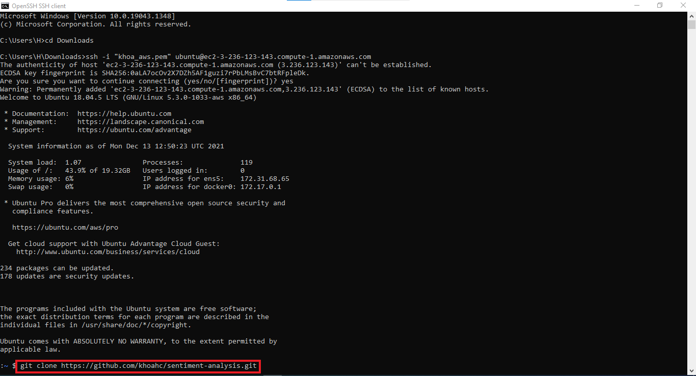
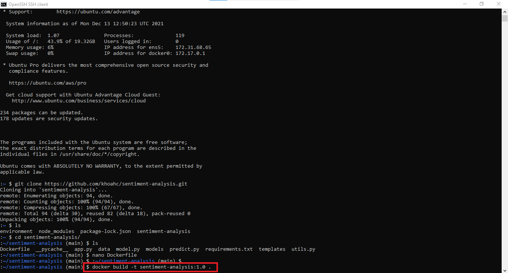
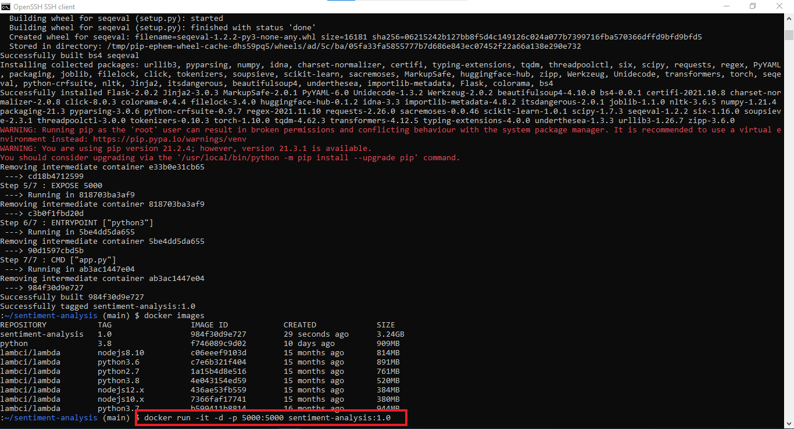
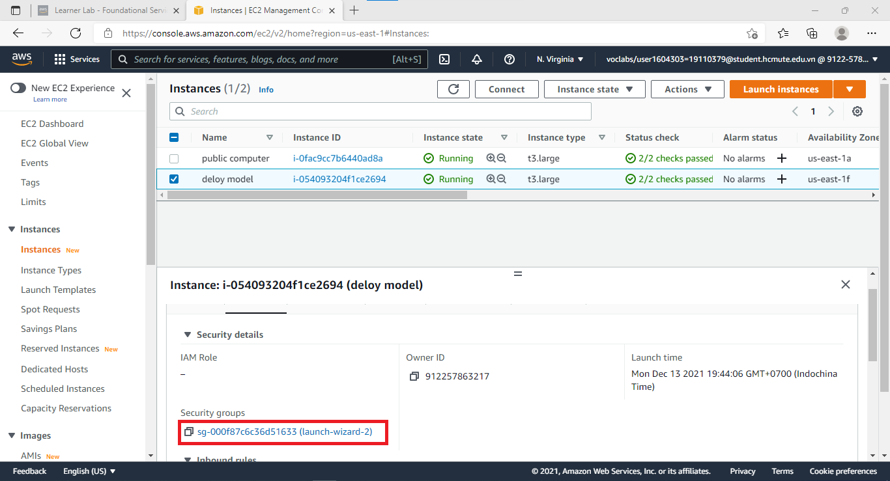
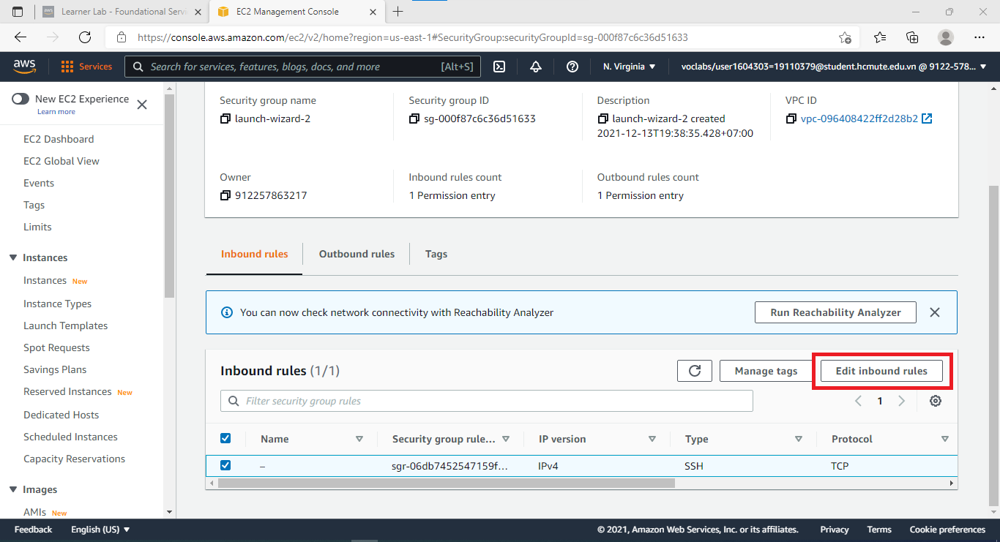
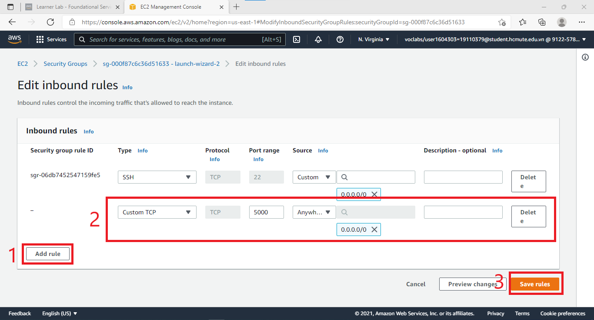
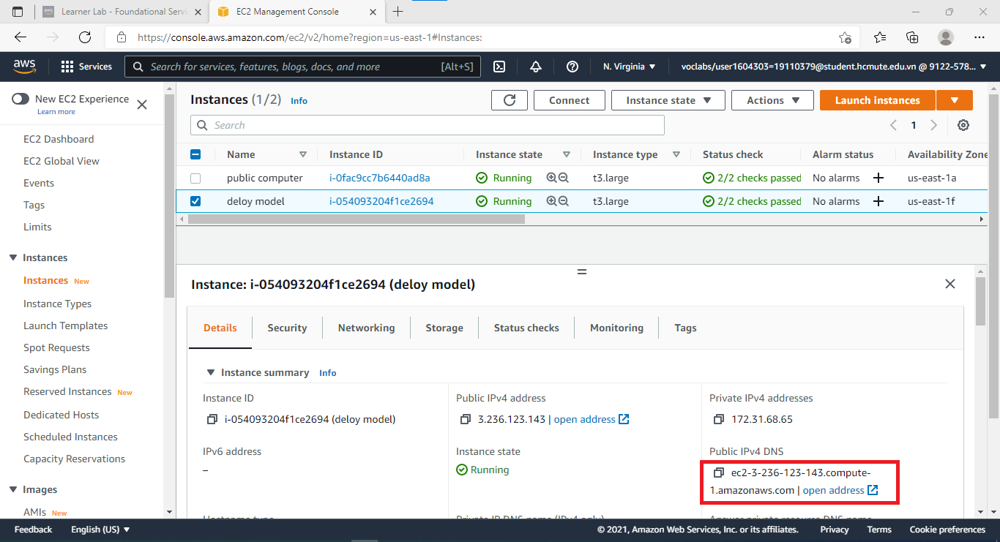
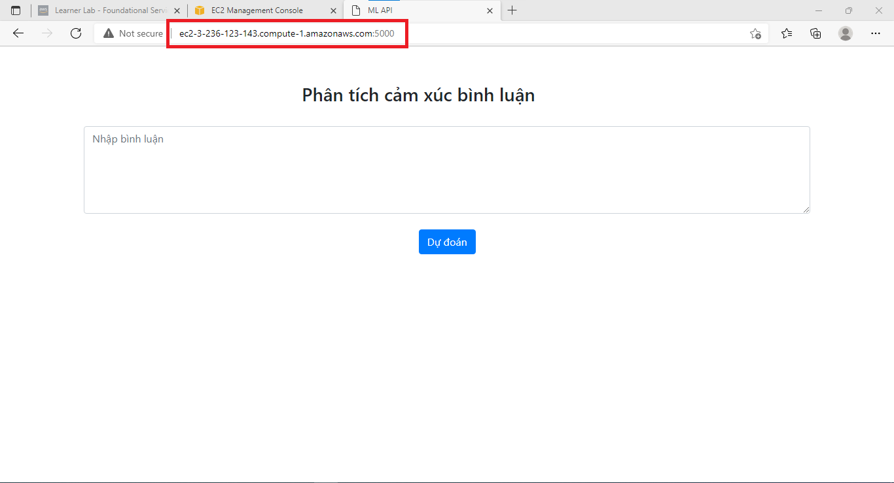
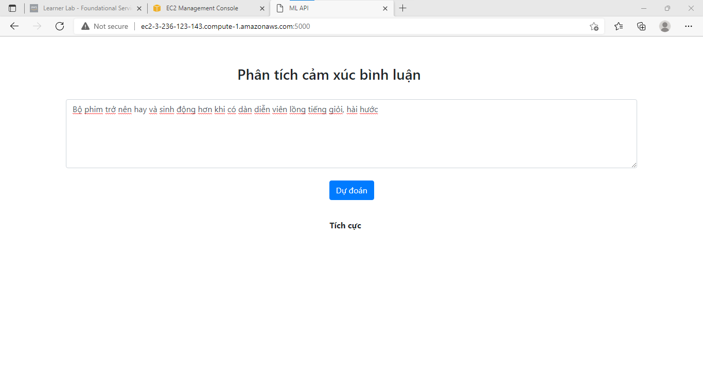

# Điện toán đám mây
# Nhóm 25: Đề tài Amazon SageMaker
### Danh sách thành viên:
### Đặng Đăng Khoa: 19110379
### Võ Văn Hậu: 19110361

# Gồm 2 phần chính:
## Tạo model dự đoán cảm xúc qua bài nhận xét
### Bước 1: Đăng nhập vào AWS Management Console, sau đó tìm kiếm và truy cập dịch vụ SageMaker.
### Bước 2: Click vào ``Notebook instances`` và chọn ``Create notebook instance`` 
### Bước 3: Tiến hành điền các thông tin cho Notebook instances mới, chọn notebook instance loại ml.m4.xlarge
### Bước 4: Điền url github repository và click ``Create notebook instance``:
```bash
https://github.com/king3Bi/DTDM_SageMaker.git
```
### Bước 5: Chờ khoảng 2,3 phút để Notebook instance khởi động.
### Bước 6: Click vào ``Open Jupyter`` và chờ vài giây, tiếp theo giao diện sẽ hiển thị thư mục github repository mà ta đã cài lúc nãy. Như vậy ta đã có tài nguyên để tạo mô hình dự đoán cảm xúc qua nhận xét.
### Bước 7: Vào đường đẫn ``DTDM_SageMaker/Project`` và mở vào file ``Project vietnamese.ipynb``
### Bước 8: Chỉ cần chạy lần lượt các cell code trong file `Project vietnamese.ipynb` là có thể tạo ra model

## Deloy model lên ứng dụng web
### Bước 1: Tạo EC2 và login vào máy EC2
### Bước 2: clone link git chứa ứng dụng web về máy EC2
```bash
git clone https://github.com/khoahc/sentiment-analysis.git
```
### 
### Bước 3: Ta có file Dockerfile trong thư mục vừa clone, ta nhập lệnh sau để tiến hành build 1 image:
``` bash
docker build -t sentiment-analysis:1.0 .
```
### 
### Bước 4: Vì ứng dụng web trong image lắng nghe trên port 5000. Để chạy 1 container với image đã được built, dùng lệnh: 
```bash
docker run -it -d -p 5000:5000 sentiment-analysis:1.0
```
### 
### Bước 5:	Vì chạy container trên port 5000, nên ta cần mở port 5000 trong securiy group.
### 
### 
### 
### Bước 6: Copy DNS của EC2
### 
### Bước 7: Truy cập vào ứng dụng web vừa mới deloy
### 
### Bươc 8: Kết quả
### 
