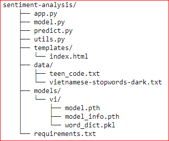

# Điện toán đám mây
# Nhóm 25: Đề tài Amazon SageMaker
### Danh sách thành viên:
### Đặng Đăng Khoa: 19110379
### Võ Văn Hậu: 19110361

# Gồm 2 phần chính:
## Tạo model dự đoán cảm xúc qua bài nhận xét
## Tạo 1 notebook instance loại ml.m4.xlarge

## Sau khi tạo, click vào **Open JupyterLab**

## Sau khi đã vào được **JupyterLab**
### Chọn git -> clone reponsitory, rồi nhập link github
### Click vào clone

## Sau khi clone reponsitory
### Mở **DTDM_SageMaker/Project/SageMaker Project.ipynb**
### Chạy các cell trong SageMaker Project.ipynb để tải dữ liệu, chuẩn bị dữ liệu, train và deloy model vào endpoint

## Deloy model lên ứng dụng web
### Tải file `model.tar.gz` về máy EC2
### clone link git https://github.com/khoahc/sentiment-analysis.git về máy EC2
ứng dụng web có cấu trúc như sau:

 
### Giải nén file `model.tar.gz` vào trong thư mục models/vi ta được 3 file model.pth, model_info.pth, word_dict.pkl
### Chạy lệnh: `pip3 install -r requirements.txt` để cài đặt môi trường
### Sau đó chạy lệnh: `python3 app.py` để khởi chạy ứng dụng web
